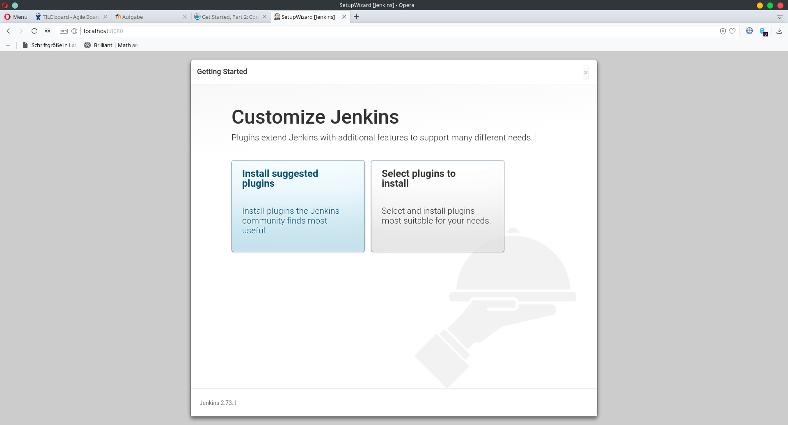
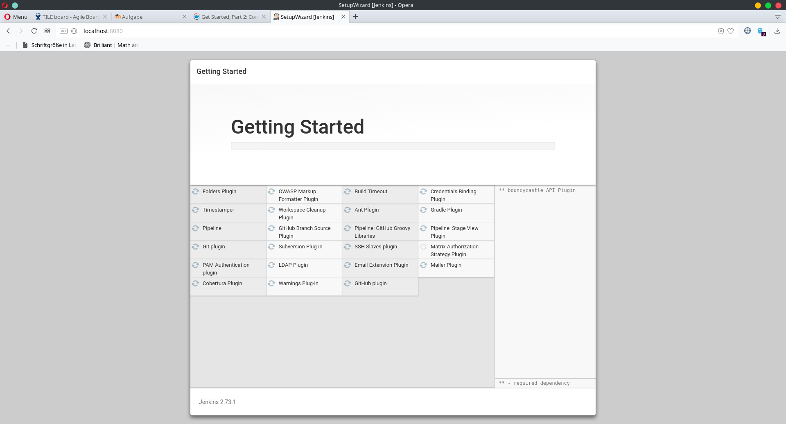
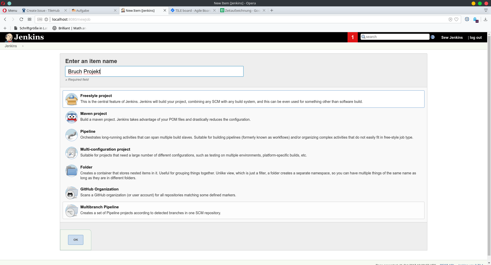

= A04: Continuous Integration mit Jenkins
Markus Reichl <markus@re1.at>
v1.1, 2017-12-01
:toc:
:toc-title:
:toclevels: 3
:nofooter:

"Continuous Integration is a software development practice where members of a team integrate their work frequently, usually each person integrates at least daily - leading to multiple integrations per day. Each integration is verified by an automated build (including test) to detect integration errors as quickly as possible. Many teams find that this approach leads to significantly reduced integration problems and allows a team to develop cohesive software more rapidly. This article is a quick overview of Continuous Integration summarizing the technique and its current usage." - M.Fowler

Lass das Bruch-Projekt mithilfe von Jenkins automatisch bei jedem Build testen!

== Grundanforderungen (70%):

=== Installiere auf deinem Rechner bzw. einer virtuellen Instanz das Continuous Integration System Jenkins
Zur Installation von Jenkins wurde ein Docker Container auf Basis des offiziellen Jekins Docker Images erstellt.
Das fertige Image findet sich unter https://hub.docker.com/re1coy/sew-jenkins/.

[source, Dockerfile]
----
FROM jenkins/jenkins:lts
# Use root
USER root
RUN apt-get update -y
# Python
RUN apt-get install python3 -y
RUN apt-get install python3-nose -y
RUN apt-get install python3-nosexcover -y
RUN apt-get install python3-mock -y
RUN apt-get install python3-sphinx -y
RUN apt-get install pylint3 -y
RUN apt-get install pylint -y
RUN apt-get install make -y
# Back to jenkins
USER jenkins

EXPOSE 8080
----

Der Docker Container kann zudem einfach auf Basis einer Docker Compose Datei mit der gegebenen Konfiguration aufgesetzt werden.

[source, yml]
----
version: '3.2'

services:
  sew-jenkins:
    build:
      context: .
    restart: always
    ports:
      - '8080:8080'
    volumes:
      - '/var/jenkins_home:/var/jenkins_home'
    container_name: sew-jenkins
----

Zur Installation kann also einfach im Root Verzeichnis `docker-compose up -d` ausgeführt werden und der Dienst ist unter `http://localhost:8080` verfügbar.
Zur Anmeldung wurde in diesem Fall sowohl als Benutzername als auch als Passwort der String `sew-jenkins` verwendet.

=== Installiere die notwendigen Plugins für Jenkins (Violations, Cobertura)
Nach der Installation wurden die Plugins gewählt wobei unter anderem die Git und GitHub Plugin Installationen fehlschlugen.
Das Problem wurde jedoch beim zweiten Versuch, in Jenkins selbst, behoben.

==== Installiere Nose, Pylint und coverage (mithilfe von pip)
Die Installation dieser Module wurde bereits im Dockerfile (siehe oben) übernommen.

==== Integriere dein Bruch-Projekt in Jenkins, indem du es mit Git verbindest
Um das Projekt mit GitHub zu verbinden wurde dieses über ein Plugin hinzugefügt. In diesem Fall: `https://github.com/mreichl-tgm/sew-5-jenkins/`

==== Überlege dir und argumentiere eine sinnvolle Pull-Strategie
Da sich Intervalle bei einem einfachen Beispiel kaum lohnen wurde beschlossen nur beim pushen von Änderungen zu builden.
Da diese Einstellung mit GitHub eine Sicherheitslücke darstellt wurde auf diesen Punkt verzichtet.

==== Konfiguriere Jenkins so, dass deine Unit Tests automatisch bei jedem Build durchgeführt werden inkl. Berichte über erfolgreiche / fehlgeschlagene Tests und Coverage
Der Build Tasks selbst wurde in Jenkins wie folgt definiert:
[source, commandline]
----
nosetests3 --with-xunit --all-modules --traverse-namespace --with-coverage --cover-inclusive ./tests
python3 -m coverage xml ./tests/__init__.py
pylint3 -f parseable -d I0011,R0801 bruch > pylint.out
----

==== Protokolliere deine Vorgehensweise (inkl. Zeitaufwand, Konfiguration, Probleme) und die Ergebnisse (viele Screenshots!)
Der ganze Vorgang dauerte etwa 2 Stunden, inklusive einer Stunde pylint :)
Die Screenshots finden sich im Guide Ordner.

== Erweiterungen (30%):

=== Konfiguriere und teste eine Git-Hook, sodass Änderungen auf GitHub automatisch einen Build auslösen! Dokumentiere deine Vorgangsweise (mit Screenshots)!
Sicherheitslücke.. Im Prinzip müsste nur der eigene Jenkins Port freigegeben werden und über das GitHub Plugin mit integriert werden.

=== Recherchiere, wie mithilfe von Jenkins GUI-Tests durchgeführt werden können und baue selbstständig einen Beispiel-GUI-Test ein! Dokumentiere deine Vorgangsweise (mit Screenshots)!
http://macoscope.com/blog/automated-ui-testing-with-jenkins-ci/

=== Lass deine Sphinx-Dokumentation automatisch mitbuilden und veröffentlichen! Dokumentiere deine Vorgangsweise (mit Screenshots)!
Um dem Benutzer mehr Freiheit zu lassen wird das source directory behalten und nur gebuildet.
Dazu einfach das Buildscript erweitern um:
[source, commandline]
----
sphinx-build -b html ./docs/source ./docs/build
----
oder
[source, commandline]
----
cd ./docs
make html
----
Zudem sollte die Zeile
[source, commandline]
----
./docs:/var/jenkins_home/workspace/sew-4-bruch/src/
----
der `docker-compose.yml` hinzugefügt werden.
